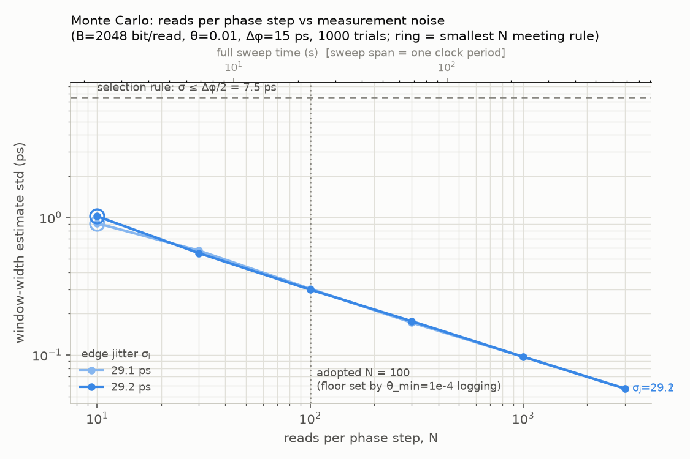
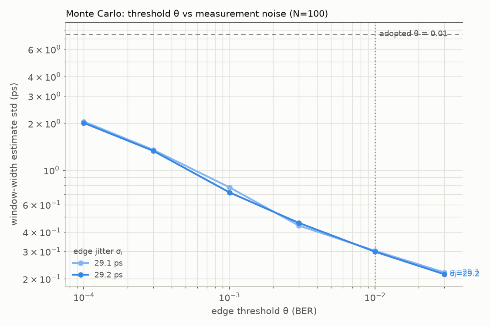
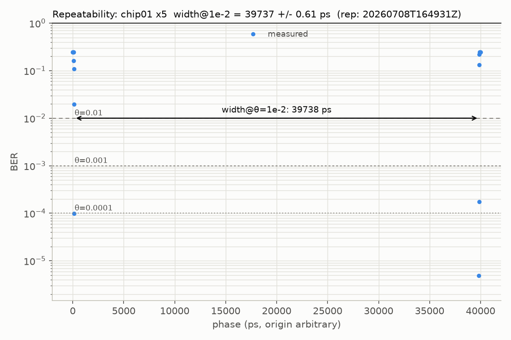
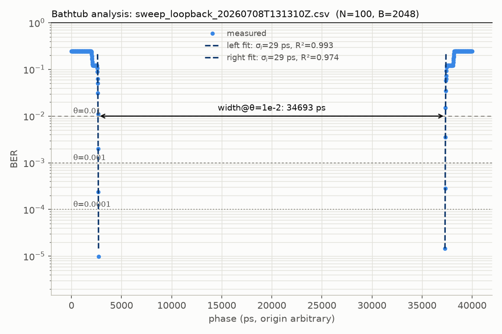

 

# flash-margin-bench

**FPGA 기반 플래시 메모리 마진 계측 플랫폼**

## 한 줄 요약

플래시 메모리가 **불량인지 판정하는 대신, 여유(마진)가 얼마나 남았는지를 피코초 단위로 측정한다.**
PASS/FAIL이라는 1비트짜리 답 대신, 단위가 있는 연속적인 물리량(유효 윈도우 폭, ps)을 얻는다.

## 방법 (3줄)

1. **위상 스윕** — FPGA의 MMCM 미세 위상 제어로 읽기 샘플 클럭을 **Δφ = 15.873ps** 간격으로 밀며, 각 위상에서 PRBS15 패턴을 N회(1회 = 2,048비트) 읽어 비트 에러를 센다 — 아래 게재 수치는 **N = 100**, 현행 실칩 표준은 **N = 112**(수정안 #2).
2. **욕조 곡선 → 폭** — 위상 대 BER 곡선의 양쪽 벽에서 판정 기준 **θ = 10⁻²** 와의 교점을 구해, 데이터가 올바르게 읽히는 **유효 윈도우 폭(ps)** 을 산출한다.
3. **측정을 먼저 의심한다** — 칩 없이 FPGA 단독 루프백으로 메커니즘을 물리 검증(G0)한 뒤 실칩에 들어가고, 같은 칩 5회 반복으로 측정 노이즈 플로어를 정량화(G4)한 다음에만 실칩 수치를 주장한다.

> 에러가 나기를 기다리는 것이 아니라, 측정 장비 쪽이 경계까지 다가간다. 그래서 스펙 안에서 멀쩡히 동작하는(모든 칸이 PASS인) 정상 칩에서도 실험이 성립한다.

## 측정 파라미터 근거

스윕 1회 = **위상 2,520스텝 × 100읽기 × 2,048비트 = 5.16억 비트**, 약 5분(25MHz 기준). 현행 실칩 설정(N=112·UART 921600)에서는 5.78억 비트를 **59초**에 뜬다. 스텝 수는 샘플 클럭 한 주기(UI)를 Δφ로 나눈 값이라 클럭마다 다르다 — 25MHz 2,520 / 45MHz 1,400 / 75MHz 840스텝.

**N = 100의 근거** — 파라미터는 감이 아니라 몬테카를로로 **사전 등록**했다(`host/analysis/monte_carlo_sweep_params.py`). 선택 규칙은 "폭 추정 편차 σ_width ≤ Δφ/2 를 만족하는 최소 N": 자 눈금(15.873ps)보다 통계 노이즈가 크면 낭비고, 훨씬 작아도 양자화에 묻혀 이득이 없다. N의 하한은 채택 θ가 아니라 **병행 기록 최저 θ(10⁻⁴)의 유효 조건** `N·B·θ ≥ ~20`이 정한다 → B = 2,048이면 N ≥ 98 → **N = 100**. (에러가 20개는 쌓여야 BER 추정의 상대오차가 ±22%로 실용선에 든다.)

**현행 실칩 표준은 N = 112다** (계약 수정안 #2, 2026-09-15 승인). 바꾼 이유는 통계가 아니라 **마모 실험과의 영역 정합**이다 — 112페이지 = 7섹터 = 마모 그룹 크기라 읽기 창이 마모군과 정확히 겹친다(`docs/spec/s1.wear_bench_spec.md` §2·§3). 위 사전 등록 규칙은 N = 112에서도 통과한다(σ_width = 0.16 / 0.34 / 1.35ps @θ=10⁻²/10⁻³/10⁻⁴, 규칙 한계 7.9ps). **G0 루프백은 100을 유지한다** — 칩 데이터가 아니라 자기 이력과 비교하는 경로이기 때문이다.

*가상의 욕조 곡선 위에서 "N회 읽기 → 경계 판정 → 폭 계산"을 수천 회 반복해, 폭 추정 편차를 N과 θ의 함수로 구한 것. 실측 전에 규칙을 문서로 고정했고(사전 등록), G0 체크리스트에 "실측 σⱼ로 재실행해 N=100 재확인" 절차까지 걸어 두었다.*

이 사전 등록이 결과를 지켰다 — θ = 10⁻⁴까지 통계적으로 유효하게 기록해 둔 덕분에, 아래 한계 절의 "θ 3값 폭 수렴(27ps)" 논증이 성립한다.

**시료**: W25Q64 ×10 확보 — 전수 신품 측정(용도가 아니라 단계, 10개 전부) 뒤 파일럿 1 / 종단 마모 3 / 블라인드 2 / 무마모 대조군 2 / 예비 2로 배분(정본 `docs/spec/s2.newchip_protocol.md` §1). **아래 게재 수치는 전부 chip01 단일 개체**이며, 개체 간 산포는 아직 측정 전이다.

## 결과

### 1) 실칩 클럭 사다리 — W25Q64 (chip01), 25 / 45 / 75MHz

| 클럭            | UI (1비트 시간) | width @ θ=10⁻²  | UI 대비 | 벽 폭             | 천장 BER | 2점 σⱼ (좌/우) |
| --------------- | --------------- | ------------------ | ------- | ----------------- | -------- | ---------------- |
| **25MHz** | 40,000ps        | **39,737ps** | 99.3%   | ~302ps (19스텝)   | 0.2462   | 6.3 / 10.8ps     |
| 45MHz           | 22,222ps        | 21,898ps           | 98.5%   | ~381ps (24스텝)   | 0.2462   | 9.0 / 10.8ps     |
| 75MHz           | 13,333ps        | 12,205ps           | 91.5%   | ~1,175ps (74스텝) | 0.2462   | 13.0 / 16.0ps    |

세 클럭 모두 `valid=1` 완주, 체크 2(BER floor)·4(과분산 F)·5(프레이밍 슬립) PASS.

읽을 거리 두 가지:

- **벽 폭이 클럭과 함께 증가**(302 → 381 → 1,175ps)한다. 프로토콜 아티팩트라면 스텝 수가 클럭에 따라 이렇게 체계적으로 늘 수 없다 → 관측된 벽은 **채널 물리**(대역폭 제한형, ISI류 지연 퍼짐)다.
- **천장 BER 0.2462가 세 클럭에서 완전히 동일**하다. 클럭을 3배 올려도 취약 비트 집합의 비율이 불변 → 결정론적 패턴 의존성의 가장 강한 단일 증거(랜덤 지터 지배라면 0.5로 수렴해야 한다).

### 2) 반복성 (G4) — 25MHz × 5회, 재장착 없음

**width @ θ=10⁻² = 39,737.3 ± 0.61 ps** (상대 편차 0.0015%, min 39,736.6 / max 39,738.0)
θ를 조여도 폭이 거의 안 움직인다: @10⁻³ = 39,724.2 ± 0.79ps · @10⁻⁴ = 39,710.6 ± 0.95ps (3값 총 27ps)

반복 표준편차가 1ps 미만 — "측정이 노이즈가 아니라 신호"라는 정량 증거이자, 노화 실험 개시 게이트(G5 ②: 노이즈 플로어 ≪ 노화 이동량)의 선행 지표다.

*실칩(W25Q64) 25MHz. 눈이 UI의 99.3%까지 열려 있어 양 끝 벽만 화면에 남는다 — 곡선이 비어 보이는 것이 정상이며, 그 자체가 "이 칩은 여유가 많다"는 결과다.*

### 3) 루프백 기준선 (G0) — 칩 없이 FPGA 단독

*JE1↔JE2 점퍼 루프백, 25MHz · 2,520스텝 × 100읽기 × 2,048비트. 폭 34,693ps, σⱼ = 29.1/29.2ps.*
*칩을 끼우기 전에 측정 메커니즘 자체가 욕조 곡선을 만들어낸다는 물리 검증. 실칩 채널(σⱼ ≈ 6~11ps)이 자기 배선보다 3배 가파르다는 비교 기준선도 여기서 나온다.*

### 알아낸 것의 한계 (먼저 밝힘)

- **BER 10⁻¹² 외삽 폭은 제시하지 않는다.** 벽 천이가 위상 해상도(Δφ = 15.87ps, MMCM VCO 고정)보다 가팔라, 한 스텝 만에 BER이 10⁻⁴ → >5×10⁻²로 점프한다. 가우시안 꼬리 외삽의 자격 검증(probit 선형성, 편당 4점)에 표본이 3점밖에 안 잡혀 **구조적으로 성립하지 않는다** — 어느 클럭으로 올려도 같다.
- 다만 θ를 10⁻²에서 10⁻⁴로 조여도 실측 폭 변화가 27ps(0.07%)에 그쳐, 본 채널은 **결정론 성분이 지배하는 저지터 채널**로 판단되며 실측 폭의 대표성은 θ 선택에 둔감하다. 관측 범위 밖 추가 협착도 σⱼ ≤ 11ps 대입 시 양벽 합계 약 75ps(폭의 0.2%) 이내로 상한된다(보증이 아닌 모델 의존 상한).
- 추가 판독(포화 천장 0.246, 구간 기울기 비선형)은 단일 가우시안 모델의 부적합을 시사 → 후속 연구에서 2성분 지터 모델(dual-Dirac) 검토.
- **게재 등급은 25MHz만.** 45/75MHz는 사다리 교차검증 목적의 수집분으로, 원본 CSV는 커밋 대상이 아니다(재현 절차만 보존).
- 온도·전압 축은 이 시점에서 **의도적 제외** — 히터·레벨 시프터(전용 보드)가 전제라 일정 도박이 된다. 중간보고 이후 착수.

**재현**: 위 수치·그림은 `.venv/bin/python host/analysis/repeatability_aggregate.py <5개 CSV>` 로 재생성된다.
단 스윕 원본 CSV는 용량상 커밋 대상이 아니므로(`data/` 로컬 보관), clone 상태에서 되는 것은 **게재 요약본 열람**까지다 — 숫자를 다시 만들려면 실측이 필요하다. 명령은 `docs/commands.md`, 흐름과 상태는 `docs/project_pipeline.md`, 게이트별 기대 출력은 `docs/workflow/4.gate_map.md`.

## 고도화 방향 (PE 기준)

| 축                  | 내용                                                                                            | 추가 장비               |
| ------------------- | ----------------------------------------------------------------------------------------------- | ----------------------- |
| 1. 측정 시스템 분석 | 재장착·보드·일자를 포함한 Gage R&R(%GRR·ndc). 현재 ±0.61ps는 재장착 없는 반복성(EV) 한 조각 | 불필요                  |
| 2. 테스트 시간 단축 | 전수 2,520스텝 → 이분 탐색 + 벽 근방 조밀화(~52스텝). 현재 5분 중 순수 측정은 20.6초(7%)       | 불필요                  |
| 3. 코너 특성화      | 온도·전압 슈무 자동화, 온도계수(ps/°C)·전압 민감도                                           | 히터·레벨 시프터·보드 |
| 4. 가드밴드 유도    | 측정 불확도 + 개체 산포 + 코너 이동량 → 테스트 리밋 결정                                       | 불필요 (1·3의 결론)    |
| 5. 노화·수명 역산  | G5 통과 후 종단 마모, 교정 곡선(band), 블라인드 오차 ±X% -> 공모전 계획에도 포함          | 시간 (비가역)           |
| 6. 결정론 지터 분해 | 천장 BER 0.2462의 정체 — 패턴 설계(lone-1·CID)로 DDJ 분리                                     | 불필요 (도전 과제)      |
| 7. Correlation      | 오실로스코프 파형 교차검증 — 현재 오라클 3종이 전부 디지털·논리 영역                          | 스코프 300~500MHz       |
| 8. Outlier 스크리닝 | 신품 분포 기반 이상치 판별(PAT). 통계적 유의성은 30개 이상부터                                  | 칩 추가                 |

축 1·2·4는 **현재 하드웨어만으로 완결된다.**

---

## 더 보려면

| 무엇 | 어디 |
| ---- | ---- |
| 사람이 치는 명령 (빌드·실칩 측정·P/E 엔진·분석) | `docs/commands.md` |
| 무엇이 무엇으로 이어지고 어디까지 됐나 | `docs/project_pipeline.md` · 게이트별 기대 출력 `docs/workflow/4.gate_map.md` |
| 폴더 구조·환경·git 규칙 | `docs/CONTRIBUTING.md` |
| 역할 분담 | `docs/roles.md` |
| 그날의 순서 (워크플로·런북) | `docs/workflow/README.md` |
| 왜 그렇게 정했나 (작업 로그) | `docs/log/README.md` |
| 빌드 산출물·검증 수치의 원전 | `docs/build_reproduction.md` |
| 사양·인수 기준 | `docs/spec/` · 인터페이스 계약 `docs/interface/` |
| 게재 확정 산출물 | `docs/results/` |

## 라이선스

[MIT](LICENSE)
