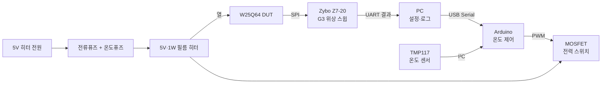

# 2. W25Q64 온도·열화 환경 구성안

- **상태**: 1차 하드웨어 구상안 — 제작·부품 검토용
- **대상**: W25Q64 SOP8 모듈 + Zybo Z7-20 G3 위상 스윕 장비
- **목표 온도**: 25°C / 40°C / 60°C
- **히터 규격**: 폴리이미드 필름 히터, **5V·1W**
- **제어 방식**: TMP117 온도 측정 → Arduino 제어 → MOSFET PWM → 필름 히터
- **관련 문서**: `docs/project_context.md` §5·§7, `docs/workflow/9.sept_meeting_role_split.md` §4

이 문서는 온도 벤치에 처음 참여하는 팀원도 전체 구조, 부품 역할, 배선, 전류 흐름,
온도 제어 원리와 실험 절차를 한 번에 이해할 수 있도록 작성한 설계 문서다.

사용할 필름 히터는 **5V·1W 제품으로 확정**한다. 따라서 정격 상태의 계산값은 다음과 같다.

```text
정격전압 V = 5V
정격전력 P = 1W
정격전류 I = P / V = 1W / 5V = 0.2A
계산상 저항 R = V² / P = 25 / 1 = 25Ω
```

실물 히터의 저항은 배선 전에 멀티미터로 측정하여 약 25Ω인지 확인한다. 히터 전원은
5V를 사용하며, 0.2A보다 충분히 여유 있는 **5V·0.5A 이상**의 전원으로 구성한다.

---

## 1. 만들려는 장치

플래시 칩 위에 폴리이미드 필름 히터를 설치하고, TMP117로 칩 표면에 가까운 온도를 읽는다.
Arduino는 측정온도와 목표온도를 비교하여 MOSFET을 PWM으로 제어한다. MOSFET은 별도
5V 히터 전원의 전류를 켜고 끄며 히터의 평균 전력을 조절한다.

```text
TMP117이 온도를 측정
        ↓ I²C
Arduino가 목표온도와 비교
        ↓ PWM
MOSFET이 히터 전류를 ON/OFF
        ↓
필름 히터의 평균전력 변화
        ↓
열확산판과 W25Q64 온도 변화
        └──────── TMP117이 다시 측정
```

출력 결과를 다시 입력으로 읽어 조절하는 이 구조를 **폐루프 제어**라고 한다.

이 장치는 히터만 사용하므로 주변온도보다 높게 가열할 수는 있지만 능동적으로 냉각할 수는
없다. 실험실 온도가 27°C라면 히터만으로 25°C를 만들 수 없다. 25°C 조건은 실내온도 조절
또는 별도 냉각수단이 필요하다.

---

## 2. 전체 시스템



첫 시제품은 Arduino를 독립 온도 제어기로 사용한다. 현재 프로젝트 문서는 최종적으로 Zynq
PS의 PID 제어를 상정하지만, Arduino로 먼저 센서·히터·열구조를 검증하면 G3 비트스트림과
PS 앱을 변경하지 않고 하드웨어를 브링업할 수 있다. 열구조와 제어값이 확정된 뒤 동일한 제어
논리를 PS로 옮길 수 있다.

---

## 3. 부품별 역할

| 부품 | 역할 | 주의점 |
| --- | --- | --- |
| W25Q64 | 온도에 따른 읽기 마진과 열화를 측정할 DUT | 실물 칩 전체 마킹으로 동작온도 등급 확인 |
| 5V·1W 필름 히터 | 전기에너지를 열로 변환 | 정격 5V를 초과하지 않음. 예상 정격전류 0.2A |
| 열확산판 | 히터의 국부적인 열을 칩 표면에 고르게 전달 | 금속판이 SOP8 핀과 납땜부에 닿지 않게 함 |
| 얇은 열전도 접착제 | 칩과 열확산판 사이 공기 틈 제거 및 고정 | 두꺼운 단열재가 아니며 가능한 한 얇게 사용 |
| TMP117 | 자신의 온도를 디지털 값으로 측정해 Arduino에 전달 | 칩 내부 다이 온도가 아니라 센서 위치의 온도 |
| Arduino | TMP117 값을 읽고 목표온도와 비교해 PWM 계산 | 센서 오류·과열 시 PWM을 즉시 0으로 설정 |
| MOSFET | Arduino 신호로 히터의 0.2A 전류 경로를 연결·차단 | Gate 전압에서 완전히 켜지는 로직레벨 N-MOSFET 사용 |
| 별도 5V 전원 | 필름 히터에 최대 1W 공급 | 5V·0.5A 이상 권장, 전류 제한 기능이 있으면 유리 |
| 전류퓨즈 | 단락·배선 오류·MOSFET 고장에 의한 과전류 차단 | 0.315A 또는 0.5A를 후보로 실제 시험 후 확정 |
| 온도퓨즈/온도스위치 | 제어 프로그램이나 센서 고장 시 과열 차단 | 열확산판 가까이에 부착하고 히터 전원선에 직렬 연결 |
| 단열재 | 주변 공기로 빠지는 열을 줄임 | 내열·난연 재료 사용, 센서와 전선을 누르지 않음 |

### 3.1 TMP117만으로 온도를 조절할 수 없는 이유

TMP117은 온도를 측정할 뿐 히터 전류를 조절하지 않는다. 다음 네 기능이 모두 필요하다.

1. TMP117: 현재 온도 측정
2. Arduino: 목표값과 비교하고 필요한 PWM 계산
3. MOSFET: 히터 전류 경로를 ON/OFF
4. 필름 히터: 최대 1W 전력을 열로 변환

### 3.2 MOSFET의 역할

MOSFET은 Arduino의 작은 PWM 신호를 받아 별도 5V 전원에서 흐르는 히터 전류를 제어하는
전자 스위치다. 전류를 새로 만들거나 5V로 승압하지 않는다.

---

## 4. 기계·열 구조

권장 적층 순서는 다음과 같다.

```text
             단열재
    ─────────────────────
       히터       TMP117
    ─────────────────────
       구리/알루미늄 열확산판
    ─────────────────────
       얇은 열전도 접착제
    ─────────────────────
       W25Q64 검은 패키지
    ─────────────────────
       플래시 모듈 PCB
```

### 4.1 열전도 접착제를 사용하는 이유

W25Q64의 검은 몰드 패키지 표면은 전기적으로 절연되어 있다. 열확산판이 패키지 몸체 안에만
있고 핀에 닿지 않는다면 별도의 두꺼운 절연 패드는 필요 없다. 하지만 금속판과 칩을 마른
상태로 맞대면 미세한 공기 틈이 생긴다. 얇은 열전도 접착제는 이 틈을 메우고 열확산판을
고정한다.

금속 열확산판이 패키지 밖으로 돌출되어 핀 두 개를 동시에 건드리면 합선될 수 있다. 따라서
열확산판 크기와 고정 위치를 먼저 확인한다.

### 4.2 TMP117 위치

열확산판을 칩보다 약간 크게 만들고 히터 옆에 TMP117을 배치한다.

```text
위에서 본 열확산판

┌───────────────────────┐
│  5V·1W 필름 히터       │
│                       │
│               TMP117  │
└───────────────────────┘
```

TMP117을 히터 바로 위에 붙이면 칩보다 히터 자체 온도를 더 크게 반영할 수 있다. 센서가 있는
열확산판 지점을 제어온도의 기준점으로 정의하고 모든 시료에서 동일한 위치와 압력으로 장착한다.

TMP117 값은 `die_temp_c`의 직접 측정값이 아니다. 분석 데이터에는 우선 `sensor_temp_c`
또는 `case_temp_est_c`로 기록한다. 다이 온도로 주장하려면 별도의 열모델이나 교정이 필요하다.

### 4.3 Zybo는 가열하지 않는다

플래시 모듈만 작은 단열 공간에 넣고 Zybo는 실온에 둔다. FPGA와 MMCM까지 가열되면 G3
마진 변화에 DUT 온도와 계측기 온도가 함께 섞인다.

히터선은 한 쌍으로 꼬고 SPI 점퍼선에서 떨어뜨린다. 온도별 측정 중 모듈을 재장착하거나
점퍼선 위치를 바꾸지 않는다. 열장치를 장착한 뒤 25°C 기준선을 새로 측정한다.

---

## 5. 전기 연결

### 5.1 로우사이드 MOSFET 회로

```text
5V 히터 전원 +
    │
 [전류퓨즈]
    │
 [온도퓨즈 또는 독립 온도스위치]
    │
 [5V·1W 필름 히터]
    │
    └──────────── MOSFET Drain(D)

Arduino PWM ── 100Ω ── MOSFET Gate(G)
                            │
                           10kΩ
                            │
MOSFET Source(S) ───────────┴── 5V 전원 GND
                                  │
                                  └── Arduino GND
```

`100Ω`은 Gate 충·방전 시 순간전류와 스위칭 잡음을 줄이는 시작값이다. `10kΩ`은 Arduino가
초기화되거나 분리됐을 때 Gate를 0V로 내려 히터가 우발적으로 켜지지 않게 한다.

N채널 MOSFET은 단순한 `VGS(th)`가 아니라 실제 Arduino 출력전압에서 명시된 `RDS(on)`을
확인한다. 3.3V MCU라면 2.5V 또는 3.3V Gate 구동에서, 5V Arduino라면 4.5V Gate 구동에서
낮은 저항이 보장된 로직레벨 제품을 고른다. 정격전류는 0.2A보다 충분히 큰 제품을 사용한다.

### 5.2 공통 GND

절연 구동기를 사용하지 않는 위 회로에서는 다음 GND가 연결되어야 한다.

```text
TMP117 GND
Arduino GND
MOSFET Source
5V 히터 전원 마이너스
```

그래야 MOSFET이 Gate 전압을 Source 기준으로 올바르게 판단한다. 히터의 0.2A 전류가 TMP117
또는 SPI 신호 GND 배선을 지나지 않도록 히터 전류 경로는 굵고 짧게 별도로 배선한다.

### 5.3 PWM ON일 때

Arduino가 Gate를 HIGH로 만들면 Drain과 Source 사이가 연결된다.

```text
+5V → 전류퓨즈 → 온도퓨즈 → 히터 → Drain → Source → GND
```

완전한 귀환 경로가 만들어져 히터에 약 0.2A가 흐르고 약 1W로 가열된다.

### 5.4 PWM OFF일 때

Arduino가 Gate를 LOW로 만들면 Drain과 Source 사이가 끊어진다.

```text
+5V → 전류퓨즈 → 온도퓨즈 → 히터 → Drain   X   Source → GND
```

히터의 +쪽에 5V가 남아 있어도 GND로 돌아가는 길이 없으므로 전류와 히터 전력은 거의 0이
된다. 스위치를 마이너스 쪽에 두어도 전체 회로가 끊기는 이유다.

---

## 6. PWM과 평균 히터 전력

PWM(Pulse Width Modulation)은 MOSFET을 빠르게 ON/OFF하면서 전체 시간 중 ON인 비율을
바꾸는 방법이다. 이 비율을 듀티비라고 한다.

```text
PWM 20%

Gate  HIGH  ┌──┐        ┌──┐        ┌──┐
            │  │        │  │        │  │
      LOW ──┘  └────────┘  └────────┘  └────
             ON   OFF     ON   OFF
             20%  80%
```

20% PWM은 전원전압을 계속 1V로 낮추는 것이 아니다. 히터에는 ON 시간 동안 5V가 그대로
인가되고 OFF 시간에는 전류가 끊긴다. 히터의 열반응이 PWM보다 느리므로 평균전력이 낮아진다.

5V·1W 히터의 예상값은 다음과 같다.

| PWM 듀티 | ON 상태 전압·전류 | 평균전력 근사값 |
| ---: | --- | ---: |
| 0% | 0A | 0W |
| 20% | ON일 때 5V·0.2A | 약 0.2W |
| 50% | ON일 때 5V·0.2A | 약 0.5W |
| 80% | ON일 때 5V·0.2A | 약 0.8W |
| 100% | 5V·0.2A 연속 | 1W |

---

## 7. TMP117과 Arduino 연결

TMP117은 I²C로 온도값을 전송한다. 첫 브링업에는 전원 2가닥과 통신 2가닥만 필요하다.

| TMP117 핀 | Arduino 연결 | 기능 |
| --- | --- | --- |
| VCC/VIN | 선택한 로직 전압 3.3V 또는 모듈 지침의 전압 | 센서 전원 |
| GND | GND | 기준 전압 |
| SDA | SDA, Uno/Nano 계열은 보통 A4 | I²C 데이터 |
| SCL | SCL, Uno/Nano 계열은 보통 A5 | I²C 클럭 |
| ADD0 | GND | 주소를 `0x48`로 선택 |
| ALERT | 초기에는 미연결, 이후 인터럽트/안전회로 | 온도 임계값 경보 |

```text
TMP117                 Arduino
──────────────────────────────
VCC/VIN ─────────────→ 로직 전원
GND     ─────────────→ GND
SDA     ─────────────→ SDA/A4
SCL     ─────────────→ SCL/A5
ADD0    ─────────────→ GND
ALERT   ─────────────→ 초기에는 미연결
```

SDA와 SCL은 각각 4.7kΩ 정도로 센서 전원전압에 풀업해야 한다. 완제품 TMP117 모듈에는 대개
풀업과 0.1µF 바이패스 커패시터가 이미 있으므로 중복 여부를 회로도에서 확인한다.

전압 체계를 섞지 않는다. TMP117을 3.3V로 공급하면 SDA/SCL 풀업도 3.3V로 한다. 5V Arduino와
직결하려면 사용할 TMP117 모듈이 5V 전원과 5V I²C를 허용하는지 모듈 회로도까지 확인한다.
가장 단순한 구성은 3.3V 로직 Arduino 호환 보드와 3.3V TMP117 모듈을 함께 사용하는 것이다.

TMP117 온도 레지스터 주소는 `0x00`이다. 값은 16비트 2의 보수이며 변환식은 다음과 같다.

```text
temperature_c = signed_raw / 128
```

예를 들어 `0x1E00 = 7680`이면 `7680 / 128 = 60°C`다. TMP117 기본 설정은 8회 평균,
약 1초 간격 연속 측정이므로 느린 온도 제어의 첫 시험에 사용할 수 있다.

---

## 8. 전류퓨즈와 온도퓨즈

### 8.1 전류퓨즈

배선 단락, 히터 손상 또는 MOSFET 고장으로 정상 0.2A보다 큰 전류가 흐르면 회로를 끊는다.
온도를 60°C로 맞추는 부품은 아니다.

```text
정상 최대전류: 약 0.2A
초기 퓨즈 후보: 0.315A 또는 0.5A
```

최종 퓨즈는 실물 히터의 저항과 정상전류를 측정한 뒤, 정상동작 중 끊어지지 않으면서 배선과
MOSFET의 안전전류보다 낮도록 결정한다.

### 8.2 온도퓨즈 또는 독립 온도스위치

Arduino가 멈추거나 TMP117 배선이 끊어져 MOSFET이 계속 켜지는 경우 물리적으로 히터 전원을
끊는다.

| 부품 | 과열 시 동작 | 냉각 후 |
| --- | --- | --- |
| 온도퓨즈 | 내부가 영구적으로 단선 | 교체 필요 |
| 자동복귀 온도스위치 | 접점이 열림 | 식으면 다시 연결 |
| 수동복귀 온도스위치 | 접점이 열림 | 사람이 확인하고 복귀 |

60°C 실험의 초기 예시는 소프트웨어 차단 63~65°C, 독립 물리 차단 약 70°C다. 센서와 실제
칩 사이의 온도차, 히터 핫스폿과 W25Q64의 정확한 동작온도 등급을 확인한 뒤 최종값을 정한다.
TMP117이 150°C까지 측정 가능하다는 사실은 W25Q64도 그 온도에서 동작 가능하다는 뜻이 아니다.

온도퓨즈/스위치는 전원 장치 옆이 아니라 열확산판 가까이에 열적으로 결합한다. 히터 바로
위의 국부온도만 읽지 않고 보호하려는 열확산판 온도를 반영하게 설치한다.

### 8.3 안전 계층

```text
정상 제어: TMP117 → Arduino PI/PID → PWM
1차 차단: 센서오류 또는 63~65°C에서 Arduino PWM=0
2차 차단: TMP117 ALERT 경보/차단
최종 차단: 독립 온도퓨즈 또는 온도스위치
전기 고장: 전류퓨즈
```

센서값이 갱신되지 않거나 I²C 통신이 실패하거나 Arduino가 재부팅되면 기본 출력은 항상
`PWM=0`이어야 한다.

---

## 9. 온도 제어 로직

### 9.1 첫 브링업: ON/OFF 제어

목표 60°C에서 다음처럼 시작할 수 있다.

```text
온도 < 59.5°C → 히터 ON
온도 > 60.5°C → 히터 OFF
```

구조가 단순해 배선과 센서를 검증하기 쉽지만 온도가 설정값 주변에서 오르내린다.

### 9.2 운용 단계: PI 제어

열 시스템은 느리고 센서 잡음이 있으므로 처음에는 미분항 없이 PI 제어로 충분하다.

```text
error = target_temperature - measured_temperature
integral = clamp(integral + Ki × error, min, max)
duty = clamp(Kp × error + integral, 0, duty_limit)
```

1초마다 다음을 반복한다.

1. TMP117 온도 읽기
2. 센서 통신과 값 범위 확인
3. 목표온도와 현재온도 차이 계산
4. PWM 듀티 계산 및 상한 적용
5. 시간·목표온도·측정온도·듀티·오류상태 기록

```text
현재 25°C, 목표 60°C → 높은 듀티
현재 55°C, 목표 60°C → 중간 듀티
현재 59.8°C           → 낮은 유지 듀티
현재 60°C 이상        → 듀티 감소 또는 0
센서 통신 실패        → 즉시 0, 오류 래치
```

목표온도는 한 번에 25→60°C로 바꾸지 않고 초당 0.2~0.5°C 정도의 설정값 램프를 사용해
오버슈트를 줄인다. 실제 Kp·Ki와 램프율은 5V·1W 히터를 20% 같은 고정 듀티로 구동해 얻은
단계응답 곡선을 보고 결정한다.

---

## 10. G3 위상 스윕과 함께 사용하는 절차

### 10.1 온도별 특성 측정

1. 히터·열확산판·센서를 최종 위치에 고정한다.
2. 히터 OFF 상태에서 G2 JEDEC ID와 UID를 확인한다.
3. 같은 장착 상태로 25°C G3 기준선을 측정한다.
4. 목표를 40°C로 올리고 안정 조건을 기다린다.
5. 40°C에서 G3 위상 스윕을 수행한다.
6. 목표를 60°C로 올리고 다시 안정 조건을 기다린다.
7. 60°C에서 G3 위상 스윕을 수행한다.
8. 자연 냉각 후 같은 장착 상태에서 25°C 회복 측정을 한다.

권장 초기 안정 판정은 다음과 같다.

```text
|측정온도 - 목표온도| < 0.2°C
온도 변화율 < 0.02°C/s
위 조건을 3~5분 연속 만족
```

수치는 열구조 브링업 결과에 따라 확정한다.

### 10.2 기록할 값

| 항목 | 이유 |
| --- | --- |
| chip UID | 시료 혼동 방지 |
| 목표온도 | 제어 조건 |
| 센서 시작·종료 온도 | 스윕 중 드리프트 확인 |
| 평균·최저·최고 온도 | 안정성 정량화 |
| 온도 변화율 | 평형 여부 확인 |
| PWM 평균·최대 듀티 | 가열 부하와 제어 포화 확인 |
| 히터 전압·전류 | 실제 인가전력 계산 |
| P/E 누적 횟수 | 온도효과와 마모효과 분리 |
| G3 batch ID·git rev | 측정 재현성 |
| 주변온도 | 열손실 조건 비교 |

### 10.3 PWM 잡음 통제

G3는 피코초 단위 타이밍 마진을 측정하므로 MOSFET 스위칭 잡음이 결과에 섞일 수 있다.

- 5V 히터 전원은 Zybo 전원과 분리한다.
- 히터 +/− 전선을 서로 꼬고 SPI 선에서 떨어뜨린다.
- MOSFET과 히터 전류 루프는 짧게 만든다.
- 열장치 장착 상태에서 히터 OFF 25°C 기준선을 다시 얻는다.
- 동일 온도에서 PWM 듀티 또는 스위칭 조건을 바꿔 마진이 달라지는지 대조시험한다.
- 필요하면 스윕 측정 구간 사이에서만 PWM을 전환하거나 저잡음 연속전류 구동을 검토한다.

---

## 11. 온도 특성과 영구 열화의 구분

60°C에서 G3 마진이 줄었다고 해서 즉시 영구 열화라고 판단할 수 없다. 온도에 따른 일시적인
전기적 변화일 수 있다.

```text
60°C에서만 변화
25°C로 냉각 후 회복
→ 가역적인 온도 의존성

열 노출/P/E 반복 후
25°C로 냉각해도 기준선이 회복되지 않음
→ 영구 열화 가능성
```

따라서 온도별 스윕과 별도로 모든 열 노출 뒤 동일한 25°C 기준조건에서 회복 측정을 수행한다.
프로젝트의 25/40/60°C 축은 우선 코너 특성화이며, 상온~60°C만으로 고장을 발생시킨다고
주장하지 않는다. 영구 열화 평가는 P/E 횟수, 열 노출시간과 회복 측정을 함께 사용한다.

---

## 12. 1차 시제품 BOM

| 항목 | 수량 | 확정·초기 요구사항 | 남은 확인사항 |
| --- | ---: | --- | --- |
| 폴리이미드 필름 히터 | 1 | **5V·1W**, 계산상 25Ω·0.2A | 실측 저항과 크기 확인 |
| TMP117 소형 모듈 | 1 | 레귤레이터·LED가 적고 센서부가 작은 제품 | 회로도, 풀업, 로직전압 |
| Arduino 호환 MCU | 1 | I²C 1개, PWM 1개, USB 로그 | 3.3V/5V 로직 선택 |
| 로직레벨 N-MOSFET | 1 | 0.2A보다 충분한 정격, 낮은 RDS(on) | MCU Gate 전압에 맞는 부품 번호 |
| Gate 직렬저항 | 1 | 100Ω 시작값 | 스위칭 파형·EMI 시험 |
| Gate 풀다운 | 1 | 10kΩ 시작값 | 기본값 사용 가능 |
| 히터 전원 | 1 | **5V·0.5A 이상**, 전류제한 권장 | 커넥터 형식 |
| 전류퓨즈와 홀더 | 1 | 0.315A 또는 0.5A 후보 | 실측 정상·고장전류로 확정 |
| 독립 온도퓨즈/스위치 | 1 | 60°C 목표에서 약 70°C 후보 | 센서-칩 온도차와 오버슈트 |
| 열확산판 | 1 | 얇은 구리 또는 알루미늄 | 패키지·모듈 실측 치수 |
| 열전도 접착제 | 1 | 얇고 내열성 있는 제품 | 제거 가능성과 최대온도 |
| 단열재 | 1 | 난연·내열, 소형 캡 형태 | 장착공간과 열손실 |

필름 히터는 저항성 부하이므로 모터나 릴레이 코일에 사용하는 플라이백 다이오드는 기본적으로
필요하지 않다.

---

## 13. 제작·브링업 순서

### 단계 A — 부품 확인

- [ ] 5V·1W 히터 표시 확인
- [ ] 멀티미터로 히터 저항이 약 25Ω인지 확인
- [ ] 5V 인가 시 예상 최대전류 0.2A 확인
- [ ] 실물 W25Q64 전체 마킹과 온도등급 확인
- [ ] MOSFET·배선·퓨즈 정격 결정

### 단계 B — TMP117 단독 시험

- [ ] 히터 없이 I²C 주소 `0x48` 확인
- [ ] 온도 레지스터 `0x00` 읽기
- [ ] 손가락 또는 낮은 온도의 열원으로 값 변화 확인
- [ ] 센서 분리·I²C 오류 시 프로그램이 안전상태로 가는지 확인

### 단계 C — MOSFET 시험

- [ ] 히터 대신 LED 또는 저전력 더미부하로 PWM 확인
- [ ] Arduino 재부팅 중 Gate가 10kΩ으로 LOW 유지되는지 확인
- [ ] MOSFET ON/OFF에서 Drain·Source 전압 확인

### 단계 D — 저전력 가열

- [ ] 5V 전원의 전류제한을 낮게 설정하고 PWM 20% 이하부터 시작
- [ ] 실측 전류가 ON 상태에서 약 0.2A인지 확인
- [ ] 히터·열확산판·센서 온도 상승과 오버슈트 기록
- [ ] 40°C ON/OFF 제어 확인
- [ ] 60°C PI 제어 확인
- [ ] 소프트웨어 차단과 독립 온도차단을 각각 시험

### 단계 E — G3 통합

- [ ] 완성된 열구조 상태에서 25°C 기준선 재측정
- [ ] 25/40/60°C 반복 측정과 온도 로그 결합
- [ ] PWM ON/OFF 또는 듀티 변화에 따른 측정 교란 확인
- [ ] 냉각 후 25°C 회복 측정

---

## 14. 아직 확정할 항목

- [ ] 열확산판 재질·치수·두께
- [ ] TMP117 모듈과 물리 부착 방식
- [ ] Arduino 보드와 로직전압
- [ ] MOSFET 부품 번호
- [ ] 전류퓨즈 0.315A/0.5A 중 최종 정격
- [ ] 독립 온도차단 방식과 차단온도
- [ ] PWM 주파수와 G3 잡음 대조시험 방법
- [ ] PI 계수와 최대 듀티
- [ ] 센서 표시온도와 플래시 패키지 온도의 교정값
- [ ] Arduino 시제품을 최종 PS 제어로 이식할 시점과 인터페이스

---

## 15. 참고 원문

- Texas Instruments, [TMP117 데이터시트](https://www.ti.com/lit/ds/symlink/tmp117.pdf):
  I²C 연결, 온도값 변환, 전원 범위, ALERT, 레지스터와 배치 지침
- Winbond, [W25Q-JV 제품군](https://www.winbond.com/hq/product/code-storage-flash/qspi-nor/w25q-jv/?__locale=en):
  주문 접미사별 전압·동작온도·패키지 확인
- 프로젝트 내부: `docs/project_context.md` §5·§7 — DUT 보드 구조와 25/40/60°C 계획
- 프로젝트 내부: `docs/workflow/9.sept_meeting_role_split.md` §4 — 온도 벤치 담당 산출물

