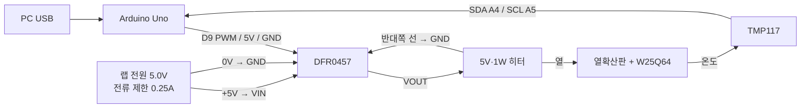

# 4. DFR0457 기반 TMP117 온도 제어 최종 연결

- **목적**: 5V·1W 폴리이미드 히터를 TMP117 온도값에 따라 Arduino PWM으로 제어
- **히터 실측 저항**: 약 26.6Ω
- **예상 연속 전류**: `5V / 26.6Ω = 0.188A`
- **예상 연속 전력**: `5V² / 26.6Ω = 0.94W`
- **제어 모듈**: DFRobot DFR0457 Gravity MOSFET Power Controller
- **스케치**: `hw/arduino/temperature_controller/temperature_controller.ino`
- **임시 시험 조건**: 전류퓨즈·온도퓨즈 입고 전, 사람이 지켜보는 단시간 브링업에 한함

DFR0457은 개별 MOSFET의 Gate·Drain·Source를 직접 배선하는 모듈이 아니다. Arduino 쪽에는
`VCC/GND/Signal` 3가닥을 연결하고, 전력 쪽에는 기판에 인쇄된 `VIN/GND/VOUT` 단자를 사용한다.
Signal이 HIGH이면 VOUT이 켜지고 LOW이면 꺼진다. 공식 사양의 스위칭 주파수 상한은 1kHz이므로
Arduino Uno의 D9 기본 PWM 약 490Hz를 사용한다.

## 1. 전체 회로



## 2. 한 가닥씩 연결

전원을 모두 끈 상태에서 배선한다. DFR0457 단자 순서는 사진 방향으로 추측하지 않고 기판에
인쇄된 `VIN`, `GND`, `VOUT` 글자를 직접 확인한다.

### 2.1 TMP117 → Arduino Uno

| TMP117 | Arduino Uno | 비고 |
| --- | --- | --- |
| VCC | 3.3V | 기존 단독 시험과 동일 |
| GND | GND | 공통 기준 전압 |
| SDA | A4/SDA | 4.7kΩ으로 3.3V에 풀업 |
| SCL | A5/SCL | 4.7kΩ으로 3.3V에 풀업 |

### 2.2 DFR0457 Gravity 제어 커넥터 → Arduino Uno

| DFR0457 제어핀 | Arduino Uno | 비고 |
| --- | --- | --- |
| VCC | 5V | DFR0457 제어부 전원 |
| GND | GND | Arduino와 랩 전원의 공통 GND |
| Signal/S | D9 | 약 490Hz PWM, HIGH=ON |

Gravity 케이블 색만 믿지 말고 커넥터의 `S/VCC/GND` 표기를 확인한다. 일반적으로 빨강은 VCC,
검정은 GND지만 생산 버전이나 케이블에 따라 신호선 색은 다를 수 있다.

### 2.3 랩 전원·히터 → DFR0457 전력 단자

| 연결 출발 | 연결 도착 |
| --- | --- |
| 랩 전원 `+5.0V` | DFR0457 `VIN` |
| 랩 전원 `0V/−` | DFR0457 `GND` |
| DFR0457 `VOUT` | 히터 선 1 |
| 히터 선 2 | DFR0457 `GND` |

```text
랩 전원 +5.0V ───────────── DFR0457 VIN

랩 전원 0V ───────┬──────── DFR0457 GND
                   ├──────── Arduino GND
                   └──────── 히터 선 2

DFR0457 VOUT ─────────────── 히터 선 1

Arduino 5V  ──────────────── DFR0457 VCC
Arduino GND ──────────────── DFR0457 제어 GND
Arduino D9  ──────────────── DFR0457 Signal
```

Arduino는 USB로 전원을 공급한다. 랩 전원의 `+5V`를 Arduino의 `5V` 핀에 추가로 연결하지 않는다.
둘 사이에는 GND만 공통으로 연결한다.

## 3. 열 구조

```text
난연·내열 단열재
────────────────
5V 히터     TMP117 센서 팁
────────────────
구리/알루미늄 열확산판
────────────────
얇은 열전도 접착층
────────────────
W25Q64 검은 패키지
```

TMP117의 작은 검은 센서 IC가 열확산판에 닿아야 한다. 히터 위에 직접 올리면 칩보다 히터의
국부 온도를 읽으므로, 히터 옆의 열확산판 위에 고정한다. DFR0457과 Arduino는 단열 공간 밖에 둔다.

## 4. 퓨즈 없는 임시 시험에서 적용하는 차단

스케치는 다음 조건에서 D9 PWM을 즉시 0으로 만들고 고장을 래치한다.

1. TMP117 검색 또는 I²C 읽기 실패
2. TMP117 온도가 65°C 이상
3. 한 번의 가열 운전이 20분을 초과
4. 사용자가 `OFF` 명령 입력

고장 뒤에는 자동으로 다시 켜지지 않는다. 온도가 55°C 아래이고 센서가 정상일 때 `RESET`으로
고장을 지운 뒤, `T40` 또는 `T60`을 다시 입력해야 한다. 스케치는 재부팅 직후 항상 OFF 상태다.

이 차단은 MOSFET 단락, Arduino 정지, 센서가 열확산판에서 떨어진 채 정상적인 실온값을 계속
보내는 고장을 차단하지 못한다. 따라서 이번 임시 시험에서는 랩 전원을 **5.0V, 전류 제한
0.25A**로 설정하고, 사람이 계속 지켜보며, 자리를 비울 때는 랩 전원 출력을 끈다.

## 5. 코드 사용

1. 히터용 랩 전원 출력을 끈 상태에서 Arduino에 스케치를 업로드한다.
2. 시리얼 모니터를 `115200 baud`, 줄바꿈은 `Newline` 또는 `Both NL & CR`로 연다.
3. 시작 메시지에서 `Startup state: heater OFF`와 1초 간격 온도 로그를 확인한다.
4. 랩 전원을 `5.0V`, 전류 제한 `0.25A`로 맞춘 뒤 출력을 켠다. OFF 상태 전류는 거의 0이어야 한다.
5. `T40`을 입력해 40°C 시험을 먼저 수행한다.
6. `OFF`를 입력했을 때 PWM과 랩 전원 전류가 0으로 내려가는지 확인한다.
7. 40°C에서 과도한 오버슈트가 없을 때만 `T60`으로 진행한다.

| 명령 | 동작 |
| --- | --- |
| `T40` | 목표 40°C로 설정하고 가열 시작 |
| `T60` | 목표 60°C로 설정하고 가열 시작 |
| `T=45` | 25~60°C 범위의 임의 목표 설정 |
| `OFF` | 즉시 PWM 0, 정상 정지 |
| `STATUS` | 현재 상태·온도·PWM 출력 |
| `RESET` | 55°C 아래에서 고장 래치 해제, 히터는 OFF 유지 |
| `HELP` | 명령 목록 출력 |

로그 형식은 다음과 같다.

```text
ms,target_c,temp_c,pwm,duty_pct,state,fault
15234,40.00,31.047,96,37.6,RUN,NONE
```

초기 코드의 `PWM_LIMIT=128`은 최대 평균전력을 약 50%로 제한한다. 40°C 시험에서 상승이 너무
느리거나 목표에 도달하지 못하면 열 구조와 센서 접촉을 먼저 확인한다. 그 뒤에도 부족할 때만
`PWM_LIMIT`을 160, 180 순서로 올리고 매번 오버슈트를 기록한다. 처음부터 255로 올리지 않는다.

## 6. 차단 기능을 먼저 시험

실험용 칩을 올리기 전에 코드의 `ABSOLUTE_CUTOFF_C`를 일시적으로 `35.0f`로 바꾸고 `T40`을
입력한다. 센서가 35°C에 도달했을 때 다음 출력과 함께 PWM이 0이 되는지 확인한다.

```text
FAULT_LATCHED,OVERTEMP
```

온도가 `RESET_MAX_C` 아래로 내려간 뒤 `RESET`을 입력해도 히터가 자동으로 켜지지 않고,
다시 `T40`을 입력해야 켜지는지도 확인한다. 이 시험 후 차단값을 65°C로 되돌린다.

## 7. 공식 사양 근거

- DFRobot DFR0457: 부하 입력 5~36V, 제어전압 3.3~10V, HIGH에서 ON, 스위칭 0~1kHz
- Texas Instruments TMP117: 온도 레지스터 해상도 0.0078125°C/LSB, 온도 결과 형식은 16비트 2의 보수

