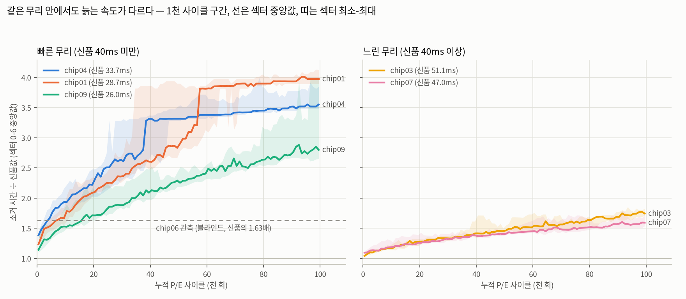
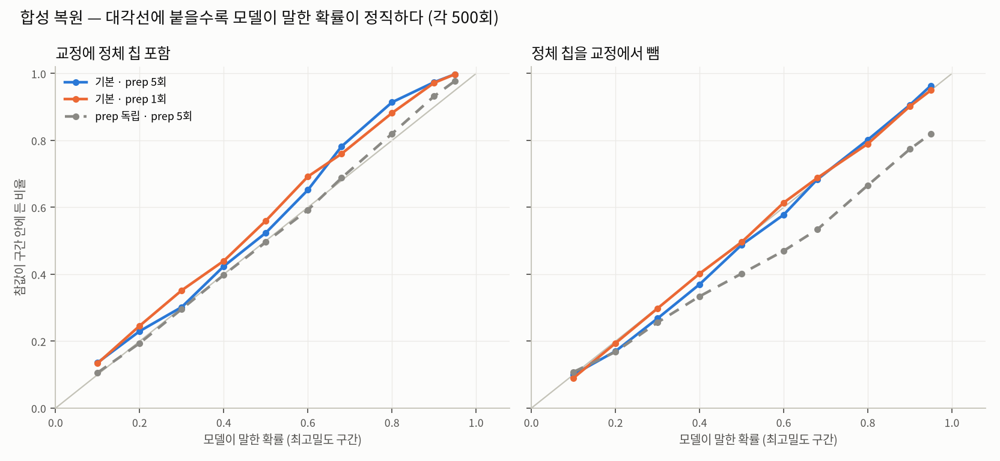

# 최종보고서 초안 — 수명 역산 모델 절 (2026-10-02)

> 담당 한영웅. 워드 본문에 옮길 초안이다. 숫자는 `final_report_material_2026-10.md` §1.4-§1.6 과 대조했고, 해석의 정본은 각 출처
> 문서(개념 15 · S-1 §15 · `blind_chip06.md` · `data/inverse/`)다. `[검토]` 표시는 옮기기 전에 팀이 확정할 자리.

---

## N. 수명 역산 모델 — 소거 시간으로 누적 P/E 사이클을 거꾸로 추정한다

### N.1 문제의 재정의 — 마진이 아니라 소거 시간

중간계획서는 "마모량-마진 교정 곡선"을 세우고 블라인드로 오차를 재겠다고 했다. 마모 실험(앞 절)이 그 전제를 깼다. 25MHz 읽기 마진은
정격 내구(100k)의 1-3배까지 재장착 3σ(42ps) 안에서 움직이지 않았다(사전 등록 H1·H1′ 참). 움직이지 않는 지표로는 역산이 성립하지
않는다. 대신 **소거 시간**이 단조 증가했다 — 터널 산화막에 갇힌 전하가 소거 전계를 약화시켜 소거 검증 루프가 길어지는, 구조에서
예측되는 지표다(개념 14). 그래서 교정 곡선의 세로축을 마진에서 소거 시간으로 바꿨다. 지표를 바꿨을 뿐 "교정 곡선 + 블라인드 검증"이라는
방법은 계획 그대로다.

문제를 다음과 같이 둔다. **이력을 모르는 칩 하나를 받아, 섹터 소거 시간만 재서 누적 P/E 사이클 x 를 구간으로 추정한다.** 답은 점이 아니라
사후확률분포이고, 보고하는 것은 최대 사후확률 구간(MAP)과 68%·95% 최고밀도 구간이다.

### N.2 입력 — 칩 안에서 신품값을 얻는다

현장의 칩에는 신품 때 기록이 없다. 입력은 개봉 전 prep(`--mode newchip`, 섹터 0-127 을 한 번씩 지우고 쓰며 시간 기록) 5회의
섹터별 소거 시간뿐이다.

| 입력 | 섹터 | 역할 |
|---|---|---|
| A — 신품값 | 32-127 소거 시간 중앙값 | 마모 섹터(0-6)에서 128KB 넘게 떨어져 영향이 없는 섹터. 그 칩의 신품 소거 시간이자 **무리 분류자** |
| B — 관측 | 0-6 소거 시간 (5회 × 7 = 35개) | 나이의 주 신호. 신품값 A 로 나눈 **배율**로 교정 곡선에 맞댄다 |
| C — 교차 확인 | 0-6 프로그램 시간 | x 추정에 넣지 않음. 무리 선택이 맞는지만 본다 |

섹터 32-127 이 신품값을 보존한다는 근거는 종단 3칩의 100k 뒤 prep 에서 그 영역 소거 시간이 신품 대비 1.00 이었던 것이다. 첫 128KB
(섹터 7-31)는 1.06-1.25 로 느려져 기준 섹터에서 뺐다. 폭·BER 바닥은 쓰지 않는다(H1′).

### N.3 교정 — 5칩 · 1,000 사이클 구간 × 섹터 분위수

교정 칩은 답을 알고 닳게 한 5칩이다. 마모 루프가 매 사이클·섹터마다 남긴 소거 시간(A 행)을 1,000 사이클 구간 × 섹터로 묶어
p10/p50/p90 을 냈다(`wear_curves.py`). p10-p90 을 두는 이유는 블라인드 관측이 중앙값이 아니라 한 번의 소거, 즉 1,000개 중 한 표본이라서다.

| 무리 | 칩 (신품 소거) | 마모 | 100k 소거 배율 | 모양 |
|---|---|---|---|---|
| 빠른 | chip01 (28.7ms) · chip04 (33.7) · chip09 | 300k · 100k · 100k | 2.8-4.0배 | 약 85 → 111ms 계단, 섹터마다 25-70k 에서 따로 |
| 느린 | chip03 (51.1ms) · chip07 (47.0) | 100k · 100k | 1.6-1.7배 | 계단 없음, 완만 |

**무리를 먼저 가르는 이유.** 같은 "신품의 1.7배"가 빠른 칩에서는 약 3천 회, 느린 칩에서는 약 10만 회다. 무리를 모르고 대면 30배
틀린다. 경계는 신품 소거 40ms — 측정한 15칩이 33.7ms 와 47.0ms 사이에 하나도 없어 그 가운데에 둔 잠정값이다. 절댓값(ms)은 무리를
가르는 데만 쓰고, 무리 안에서 나이를 맞출 때는 배율을 쓴다. 같은 무리 안에서도 신품값이 다르기 때문이다(ms 눈금으로 대면 chip04
의 태생 5ms 를 "더 닳았다"로 읽는다). 눈금 선택은 결과를 보기 전에 규칙으로 적었다 — 모의 블라인드에서 95% 포함률이 높은 쪽.
4칩 46점에서 배율 36/46 · ms 20/46 이었다.



*그림 N-1. 교정 5칩의 섹터 0-6 소거 배율(신품 대비), 무리별. 빠른 칸의 점선은 블라인드 chip06 의 관측 배율 1.63. 같은 배율이
chip04 약 4천 · chip01 약 8천 · chip09 약 1.6만 회에 걸린다 — 블라인드 구간이 넓은 이유가 이 그림에 있다.*

### N.4 모델 — 베이즈 역추정

기호: x 는 누적 P/E 사이클, b 는 1,000 사이클 후보 구간(1-1,000 … 99,001-100,000, 100개), e_i 는 i 번째 관측(배율), k 는 관측 수,
j 는 무리 안 구성원(교정 칩 × 섹터 곡선 하나, 빠른 무리 M = 21).

**(1) 우도.** 교정 표의 한 칸(칩·섹터·구간)을 정규분포 N(μ_j(b), σ_j(b)) 로 본다. μ = p50, σ = (p90 − p10)/2.56, 하한 0.02μ.
블라인드 칩의 섹터가 교정 칩의 어느 섹터를 닮았는지 모르므로 구성원 M 개를 같은 무게로 섞는다(혼합 분포).

```math
\ell_i(b) = \log\Big[\tfrac{1}{M}\sum_{j=1}^{M}\mathcal{N}\big(e_i;\,\mu_j(b),\sigma_j(b)\big)\Big]
```

**(2) 관측 결합 — 곱하지 않고 기하 평균.** 관측 35개는 같은 칩·같은 장착·같은 온도에서 나온 값이라 독립이 아니다. 독립으로
곱하면 증거가 35배라고 착각해 구간을 지나치게 좁힌다. 가장 보수적인 끝인 기하 평균(log L = (1/k) Σ ℓ_i)을 쓴다 — 관측 전체를
한 개 분량의 증거로 친다. 중간안(따로 돌린 prep 5회를 독립으로 치는 것)을 한 번 넣었다가 되돌렸다. 합성 복원에서 처음 보는 칩의
95% 구간 포함률이 96% 에서 82% 로 떨어졌기 때문이다(§N.5). 반복 prep 은 측정 잡음을 줄이지만 칩과 교정 곡선 사이의 차이는 못
줄인다.

**(3) 속도 배율 r.** 같은 무리 안에서도 늙는 속도가 다르다 — 곡선 맞춤 속도비 chip04 : chip09 = 2.9배, chip01 : chip09 = 2.0배.
곡선 모양은 같고 가로축만 늘어난 것이라, "진짜 x 인 칩은 교정 곡선의 M = x·r 지점처럼 보인다"로 두고 모르는 r 을 [1/R, R] 로그
균등 41점으로 적분한다.

```math
P(x \mid e) \;\propto\; \sum_{r}\, L\big(b(x\cdot r)\big), \qquad L(b) = \exp\Big[\tfrac{1}{k}\textstyle\sum_i \ell_i(b)\Big], \qquad \tfrac{1}{R}\le r\le R
```

**(4) 사전·사후.** 블라인드 담당자가 1,000-80,000 에서 임의로 고르므로 사전은 평평(1/100). 사후는 L 의 정규화이고, MAP 과 68%·95%
최고밀도 집합(확률 높은 구간부터 모아 누적 68%·95% 를 채운 최소 집합)을 사이클 범위로 낸다. 답의 범위는 교정 5칩이 모두 닿는
100k 까지다. 곡선 지점 M 으로는 chip01 의 300k 까지 쓴다 — r > 1 이면 x ≤ 100k 인 칩도 100k 너머 지점처럼 보이기 때문이다.

**R 의 결정 경위 — 그대로 적는다.** 처음(교정 4칩) R = 2.0 은 규칙으로 냈다: 두 쌍의 로그 속도 차이(0.34 · 0.22)의 평균 ÷ 1.13 =
개체 σ 약 0.25, 새 칩 대 교정 칩의 95% 범위 √2·1.96·0.25 = log 2.0. chip09 를 더한 뒤 같은 규칙을 네 쌍으로 다시 돌리면 R = 3.8 이
나왔고 이것으로 v2 를 한 번 냈다. 그러나 교정 칩이 무리당 셋이면 교정 곡선 혼합이 이미 2.9배 속도 범위를 품고 있어, 그 위에
r 까지 얹으면 같은 산포를 두 번 센다. 5칩 LOCO 포함률(68%/95%)이 R 1.0 에서 47/69 · 1.4 55/81 · **2.0 72/98** · 2.8 83/100 · 3.8 81/98
이라 명목에 가장 가까운 2.0 으로 되돌렸다. 이 뒤집음은 블라인드 정답을 읽기 전이었고, 버린 설정(R 3.8)의 결과도 함께 커밋해 남겼다.
"LOCO 에 맞춰 R 을 고르지 않는다"는 처음 원칙과 부딪히는 결정이다 — 근거는 구조 결함(이중 계산)이 먼저고 LOCO 는 값을 골랐다.
`[검토]` 이 문단을 본문에 둘지 각주로 내릴지.

### N.5 모델의 정직성 — 두 가지 사전 검증

블라인드 전에 모델이 말하는 확률이 실제와 맞는지(보정, calibration) 두 방법으로 쟀다. 68% 구간은 정의상 10번 중 3번은 빗나가야
한다. 포함률이 명목보다 훨씬 낮으면 과신, 훨씬 높으면 정보 없는 과소신이다.

**(가) 모의 블라인드 (LOCO).** 교정 칩 하나를 빼고 그 칩의 구간별 p50 을 관측으로 넣어 나머지로 맞힌다. 5칩 × 12점(1k·3k·10k-100k,
chip07 결측 2점) = 58점.

| 설정 | 68% 포함 | 95% 포함 | 68% 바깥 폭 중앙값 |
|---|---|---|---|
| 4칩 · 배율 · r 없음 | 26/46 (57%) | 36/46 (78%) | 15,000 |
| 4칩 · 배율 · R 2.0 | 42/46 (91%) | 46/46 (100%) | 39,500 |
| **5칩 · 배율 · R 2.0 (판정용 v2)** | **72%** | **98%** | **44,000** |

r 없이는 과신(95% 구간이 78% 만 품음), 4칩 R 2.0 은 과소신(68% 구간이 91% 품음), 5칩 R 2.0 이 명목에 가장 가깝다. LOCO 는 실전보다
어렵고(한 칩을 빼면 무리당 교정 칩이 하나 줌) 동시에 쉽다(관측이 p50 이라 한 표본의 흔들림이 없음).

**(나) 합성 복원.** LOCO 의 두 치우침을 피하려고, 모델 가정대로 가상 칩을 만들어(무리 · x ~ U(1, 100k) · r 로그균등 · 교정 칩
하나를 정체로 · 섹터별 N(p50, σ)) prep 5회를 뽑고 500회 복원했다. 명목 확률 10-95% 전부에서 포함률을 봤다(그림 N-2).

| 조건 (v2 · 500회) | 68% 포함 | 95% 포함 |
|---|---|---|
| 정체 칩이 교정에 있음 (추론 코드 점검) | 76% | 99% |
| **정체 칩을 교정에서 뺌 (처음 보는 칩 · 블라인드 조건)** | **66%** | **91%** |
| 처음 보는 칩 · prep 독립 우도 (버린 수정) | 53% | 81% |

처음 보는 칩에서 명목 68/95 에 66/91 — 과신 쪽으로 2-4%p 다. 95% 가 조금 낮은 것은 생성이 r 을 전 범위에서 뽑아 곡선 끝(100k
너머) 경계에 닿는 경우가 섞인 탓이다. prep 독립 우도는 53/81 로 뚜렷히 과신이라 되돌렸다(§N.4 (2)).



*그림 N-2. 가로 모델이 말한 확률, 세로 참값이 그 구간에 든 비율. 대각선이 정직한 모델. 기본 우도는 대각선 근처, prep 독립 우도는
전 구간에서 아래(과신).*

### N.6 블라인드 — chip06, 정답 12,000

절차: 마모 담당(박지민, 보드 B)이 1,000-80,000 에서 사이클 수를 고르고 섹터 0-6 을 마모했다. 정답의 정본은 칩 안의 tally(장부가 아니라
칩이 센 값)다. 추정자(한영웅, 보드 A)는 마모 종료 24시간 안에 prep 5회를 돌려 추정 v1·v2 를 tally 를 읽기 전에 커밋했다(`d502468` ·
`04bab2a`). 3인 팀이라 완전 블라인드는 아니다. 성공 기준은 사전 등록: ① 정답 ∈ 95% · ② 68% 바깥 폭 ≤ 60,000 · ③ MAP < 10,000 이면
68% 바깥 폭 ≤ 10,000.

관측: 기준 섹터 소거 중앙값 25.3ms → 빠른 무리. 마모 섹터 배율 중앙값 1.63 (p10-p90 1.55-1.88).

| 추정 | 교정 | MAP | 68% | 95% | 정답의 백분위 | ①②③ |
|---|---|---|---|---|---|---|
| v1 (참고) | 4칩 (빠른 01·04) | 5,001-6,000 | 2,001-11,000 | 1,001-18,000 | 79번째 · **68% 밖** | 통과·통과·통과 |
| **v2 (판정용)** | 5칩 (빠른 01·04·09) | 7,001-8,000 | **3,001-19,000** | **1,001-34,000** | **49번째 · 68% 안** | 통과·통과·**불통과** |

**결론 문장(본문용).** 블라인드 칩(정답 12,000회)에 대해 판정용 모델은 68% 구간 3,001-19,000회, 95% 구간 1,001-34,000회를 내 정답을
두 구간 모두에 품었고, 정답은 사후분포의 중앙(49번째 백분위)에 있었다. 정격 대비로는 실제 사용률 12% 를 추정 3-19%(68%) 안에
맞혔다. 교정 칩을 4개에서 5개로 늘리자 구간은 넓어졌지만, 늘리기 전 모델은 정답을 68% 구간 밖에 두었다 — 넓어진 구간이 정직한
불확실성이었다.

세 가지를 그대로 적는다.

- **③ 불통과.** 68% 폭 16,000 > 10,000. ③ 은 교정 칩이 무리당 둘이던 시점의 모의 블라인드로 정한 값이고, 무리 안 속도 산포가
  드러난 5칩 모델에서는 계단 이전 구간의 68% 폭이 1-2만이다. 기준을 소급해 바꾸지 않고 떨어진 대로 보고한다.
- **MAP 은 낮게 치우쳤다.** v2 MAP 7,001-8,000 은 정답의 0.6배. 사후분포가 오른쪽(느리게 늙는 가능성)으로 꼬리가 길어 최빈값이
  중앙값보다 앞선다. 이 칩에서는 사후 중앙값(약 1.2만)이 정답에 가까웠다. 블라인드 하나로 점 추정 방식을 정하지 않고 둘을 나란히 적는다.
- **버린 설정도 정답을 품었다.** R 3.8 추정은 32번째 백분위. R 의 뒤집음(§N.4)이 결과를 유리하게 만든 것은 아니다.

### N.7 적용 범위와 한계

- **상온 사용 이력에만.** 65°C 에서 100k 마모한 chip17 을 v2 로 맞히면 MAP 이 정답의 0.15-0.35배, 68% 포함 2/12. 고온 이력 칩을 상온
  모델로 진단하면 "덜 썼다"로 나온다 — 중고 등급 판별에서 남은 수명을 부풀리는 위험한 방향이다. 65°C 곡선은 교정에 넣지 않았다.
  단, 이 검증의 관측도 65°C 에서 잰 값이라 25°C 로 식혀 재면 정답 쪽으로 다가갈 수 있다. `[검토]` 발표(10/16) 전 측정 예정.
- **계단 이후(빠른 무리 약 5만 회 이상)는 범위만 준다.** 계단 뒤 배율 변화(35k 당 3-5%)가 칩 간 계단 높이 차(약 10%)보다 작아
  MAP 이 낮게 치우친다(chip04 LOCO 정답 100k → MAP 53k·66k). 고치지 않고 한계로 등록했다.
- **정밀도는 교정 칩 수가 정한다.** 68% 바깥 폭은 x 에 비례해 ±50% 꼴이다. 좁히는 길은 모수 조정이 아니라 교정 칩 추가와, 칩별
  속도를 직접 재는 두 번째 dose Δx 다. LOCO 에서 5천 회 추가(약 30분)는 x 3-20k 구간 68% 폭을 23,500 → 13,000 으로 약 45% 줄였고,
  1천 회는 효과가 없었다(구간당 10점 안팎이라 경향으로 읽는다).
- **무리 경계 40ms 는 잠정이다.** 경계 근처(34-47ms) 칩을 본 적이 없다. UID 앞바이트 `DF` 두 칩(chip10·14)이 33-36ms 로 빈 구간
  근처에 있다.
- **계단 전환 구간의 이봉 분포.** 전환 중 섹터는 85ms 대와 111ms 대를 오가는데(chip04 섹터 3 · 26-27k: 95-110ms 0회) 모델은 칸마다
  종 하나를 놓아 한 번도 안 나온 자리에 밀도를 준다. 전환 중인 칩을 잘못 짚을 수 있다. 미해결.
- **블라인드는 1칩.** 느린 무리(chip08) · 새 로트(chip15) 블라인드는 최종 발표까지. 2차 참조 모델(신품 기록을 아는 경우)은 미구현.
- **진단 시간.** prep 5회 약 3-4분 + 계산 수 초. 1-Click 진단의 핵심 경로다.

### N.8 계획 대비

| 중간계획서 | 달성 |
|---|---|
| 마모량-마진 교정 곡선 | 지표를 소거 시간으로 바꿔 달성. 마진은 사전 등록 예측대로 불변 |
| 블라인드로 추정 오차 정량화 | 1칩 달성(chip06). 기대 오차는 LOCO 58점 · 합성 복원 500회로 |
| 중고·재생 칩 판별 | 정격 대비 사용률(3-19%)이라는 등급 지표를 모델이 준다. 실제 중고 칩 시연은 없음 |

---

## 옮길 때 확인

- 그림 N-1 `wear_ratio_curves_2026-10.png` · N-2 `synthetic_recovery_2026-10.png`. 교정 곡선 섹터별 띠 그림(`wear_curves_<chip>_2026-09.png`)을 부록으로 둘지
- 수식 3개(혼합 우도 · r 적분 · 정규분포)는 워드 수식 편집기로. 개념 15 §3-§4 에 전개가 있다
- §N.4 "R 의 결정 경위" 문단과 §N.6 세 번째 항목은 같은 사건을 두 번 말한다 — 본문 분량에 따라 하나로 합칠 것
- chip17 25°C 재측정 결과가 10/16 전에 나오면 §N.7 첫 항목을 고친다
